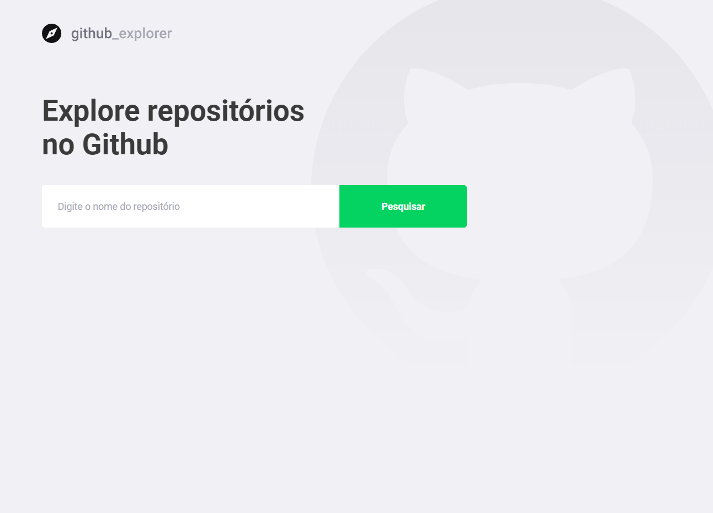
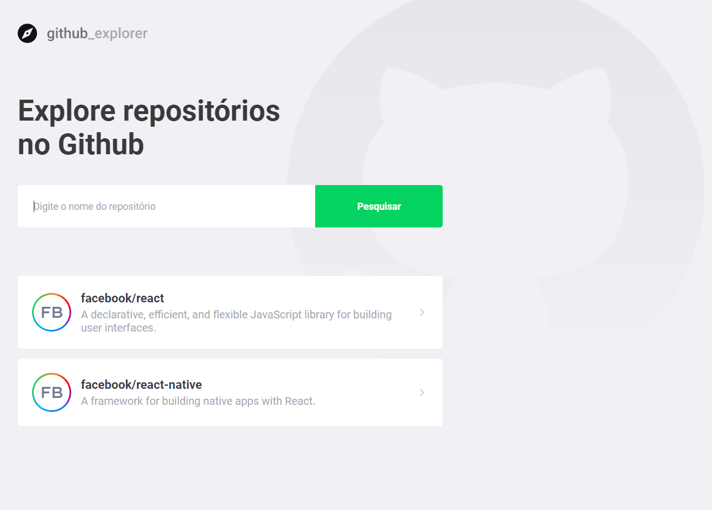

# Execução 🚀

1. Faça um clone desse repositório;
2. Entre na pasta rodando `cd ExplorerGithub`;
3. Rode `yarn` para instalar as dependências;
4. Rode `yarn start`;

# Contribua 😁

- Faça um FORK desse repositório;
- Crie uma BRANCH com a sua feature: `git checkout -b myFeature`;
- Faça COMMIT das suas alterações: `git commit -m 'my new feature'`;
- Faça PUSH para a sua BRANCH: `git push origin myFeature`;

## :memo: Licença

Esse projeto está sob a licença MIT.

###### Project developed in GoStack Bootcamp 🚀
